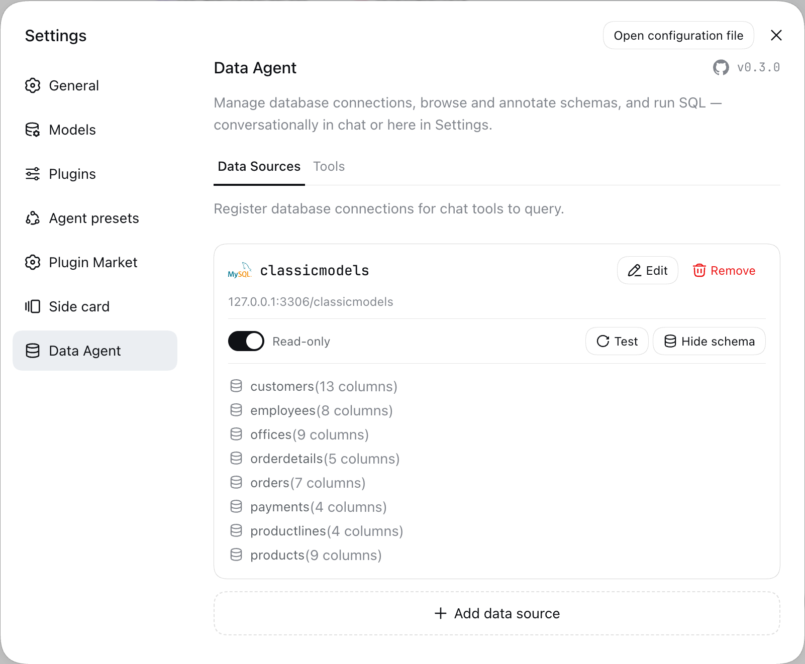
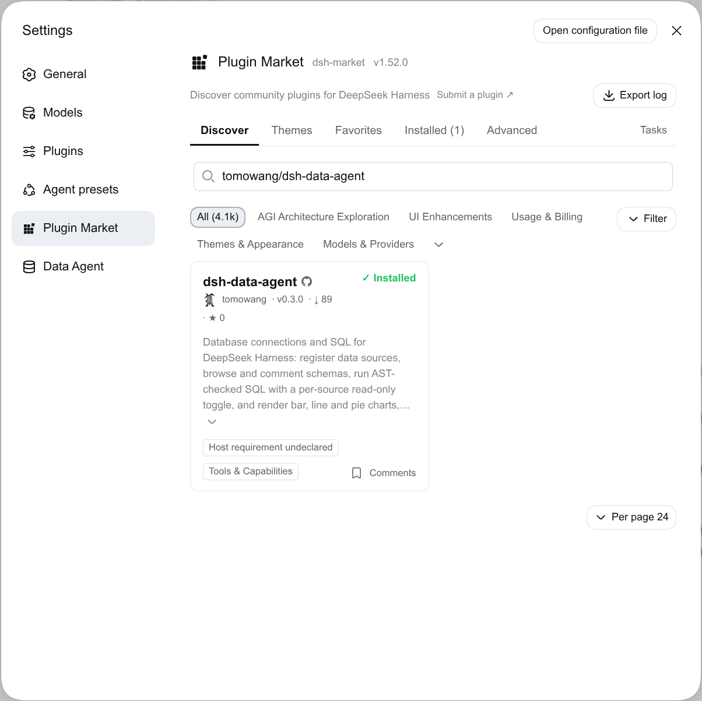
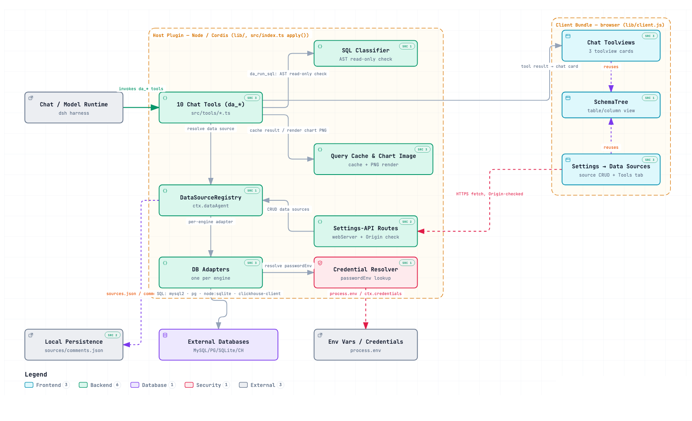

# dsh-data-agent

[](https://www.npmjs.com/package/@tomowang/dsh-data-agent)
[](https://github.com/tomowang/dsh-data-agent/actions/workflows/ci.yml)
[](https://github.com/tomowang/dsh-data-agent/actions/workflows/release.yml)
[](LICENSE)

A [DeepSeek Harness](https://github.com/deepseek-ai/deepseek-harness) (`dsh`) plugin for managing database connections and running SQL, both conversationally and from the Web UI's Settings page.

## Features

- **Data-source management** — register MySQL, PostgreSQL, SQLite, or ClickHouse connections (`da_add_data_source`/`da_edit_data_source`/`da_remove_data_source`/`da_list_data_sources`), or manage them from Settings → Data Sources.
- **Connection checks & schema browsing** — `da_test_connection` and `da_get_schema` (database overview or full column detail for one table), rendered as a Markdown table in chat and as a rich, expandable browser in both the chat card and the Settings schema viewer.
- **Table/column comments** — `da_set_comment` from chat, or click-to-edit inline in the Settings schema viewer; both write to the same store.
- **SQL execution with a read-only toggle** — `da_run_sql`, AST-verified (not string-matched) to reject write statements on a read-only source and to always reject statement-stacking. Chat can make a source read-only (`da_set_read_only`), but only the checkbox in Settings can make it read-write again, so a prompt-injected model can't lift the flag and then write.
- **Charts** — `da_render_chart` renders a `chart.js` bar/stacked-bar/line/pie chart from either `data` (inline rows) or `resultId` (a prior `da_run_sql` call's result, referenced by id instead of resent — cached in memory per conversation for 30 minutes). Alongside the interactive Web UI chart, it also rasterizes a static PNG server-side (via `skia-canvas`) and returns a URL to it, so the chart can be embedded as a Markdown image in the model's own reply.

Secrets are never stored directly: connections reference a `passwordEnv` (an environment variable **name**), resolved at connect time via the harness's `ctx.credentials` seam when mounted, else `process.env`.

The variable name must start with `DSH_DA_` (e.g. `DSH_DA_PROD_DB_PASSWORD`), so a source can never read an unrelated secret such as an API key from the host environment. Credentials are attached only from Settings → Data Sources, never from chat: the chat tools can't set `passwordEnv`, and on a source that has one they can't change `host`, `port`, `user`, `ssl`, `sslmode`, or `sslrootcert`. That way a prompt-injected model can't redirect a saved password to another host.

SQLite file paths get the same treatment. From chat, a SQLite source's path must be inside a directory listed in the plugin's `sqliteChatDirs` config, checked after resolving symlinks and `..`; `file:` URIs are refused. The list is empty by default, so SQLite sources are added from Settings unless you opt a directory in:

```yaml
config:
  sqliteChatDirs:
    - /home/me/data
```

## Demo

https://github.com/user-attachments/assets/fa149214-cdd0-4820-9711-8e7451bb462f

Connections, schema, and read-only toggling are also manageable straight from Settings → Data Agent:



## Install

Requires dsh 0.1.7-rc.2 or later, and a `web` profile already booted at least once (`dsh --profile web`). The package declares this as a `peerDependencies` range on `@deepseek-ai/dsh`: dsh 0.1.7-rc.1 and later refuse to load the plugin on an older runtime, while releases before that don't check the range at all.

```sh
# 1. Install the dsh launcher
npm install -g @deepseek-ai/dsh

# 2. Install this bundle into the web profile
dsh plugin --profile web add @tomowang/dsh-data-agent

# 3. Approve skia-canvas's native build script (needed for da_render_chart's PNG output)
dsh plugin --profile web approve-builds
```

`dsh` reconciles the profile manifest's `dsh.profile.bundles` list automatically (this package declares `dsh.bundle.patch`), fetching the published npm package — no local checkout or build step needed. Restart the `web` profile process to pick it up.

### Installing from the dsh-market

Alternatively, you can install `@tomowang/dsh-data-agent` from the [dsh-market](https://github.com/dsh-market/dsh-market) in the Web UI.
Search `tomowang/dsh-data-agent`, and click **Install** on the result.



## Develop

```sh
pnpm install
pnpm run typecheck
pnpm run test
```

Scripts:

- `pnpm run typecheck` — type-check both the Host (`tsconfig.json`) and Client (`tsconfig.client.json`) source
- `pnpm run test` — run the unit tests (vitest): SQLite in-process (no server needed), the SQL classifier, persistence, registry, and chat-tool logic. The integration suites in `tests/integration/` are skipped here
- `pnpm run test:integration` — run the MySQL/PostgreSQL/ClickHouse adapters against real servers (see below)
- `pnpm run build` — build both halves to `lib/` (`build:host` + `build:client`)
- `pnpm run build:host` / `build:client` (or `watch:host` / `watch:client`, or plain `watch` for both at once) — build one half only
- `pnpm run dev` — build both halves and link this plugin into the local `web` profile (see below)

### Integration tests

`tests/integration/` drives the MySQL, PostgreSQL, and ClickHouse adapters against real servers. It covers database-enforced read-only mode, the row cap, query timeouts, writes, and how cell types are converted. CI runs it on every push and pull request, with the servers as service containers (`.github/workflows/ci.yml`), once against MySQL 8.4 and once against MariaDB 11.4. The release workflow won't publish unless it passes.

Locally, start the same servers with Docker (or Podman) and run the suite:

```sh
docker compose up -d --wait
pnpm run test:integration
docker compose down
```

To run only some engines, set `DSH_DA_IT_ENGINES` (e.g. `DSH_DA_IT_ENGINES=postgres pnpm run test:integration`). The tests expect each server on its default port on `127.0.0.1`, with password `pw` and a database named `it`. `DSH_DA_IT_HOST`, `DSH_DA_IT_PG_PORT`, `DSH_DA_IT_MYSQL_PORT`, `DSH_DA_IT_CLICKHOUSE_PORT`, and `DSH_DA_IT_PASSWORD` override those defaults.

### Architecture



### Project layout

```
src/
  index.ts                composition root: Config, apply() — mounts the registry, tools, the Settings-API routes, and the chart-image route
  data-source/
    types.ts, errors.ts   shared vocabulary and stable error codes
    registry.ts           DataSourceRegistry (ctx.dataAgent): the Map-based connection registry
    credential.ts         passwordEnv resolution (soft ctx.get('credentials'), else process.env)
    schema-comments.ts    merges comments.json into a raw schema result (shared by the tool and the Settings route)
    persistence/          sources.json / comments.json (atomic, cross-process-safe)
    adapters/              one DataSourceAdapter implementation per engine (mysql2, pg, node:sqlite, @clickhouse/client)
  sql/classify.ts         node-sql-parser-based read-only + single-statement enforcement
  tools/                  the ten model-facing tools (one file each), plus QueryResultCache (ctx.queryResultCache),
                          chart-config.ts (shared chart.js config builder), and the chart-image render/store/route
                          backing da_render_chart's static PNG output (ctx.chartImageStore)
  settings-api/           the Settings panel's API on the harness's authenticated /api channel (ctx.connection.fetch),
                          plus the Host check still used by the raw chart-image route
src/client/                the browser bundle (see below)
  index.ts                client plugin entry: registers the three chat toolviews + the Settings section
  tool/                   da_run_sql / da_get_schema / da_render_chart chat cards (card models + components + toolview registrations)
  settings/               the Data Sources settings panel + its fetch() API client
  shared/SchemaTree.tsx   table/column browser shared by the chat card and the Settings panel
scripts/build-client.mjs esbuild build for src/client -> lib/client.js
cordis.patch.yml          the bundle layer applied when a profile lists this package
```

### Developing against the `web` profile

Local development only — this links your working copy into a profile in place of the published package, so you can iterate without cutting a release. It assumes a globally installed `dsh` CLI (`npm i -g @deepseek-ai/dsh`, or any `dsh` resolvable on `PATH`) and a `web` profile already booted at least once (`dsh --profile web`).

Link this checkout into the `web` profile and register it as a bundle:

```sh
pnpm run dev
# same as: pnpm run build && dsh plugin --profile web add .
```

This is one-time (or re-run after changing `package.json` dependencies): pnpm `link:`s this directory into the profile's `node_modules` and appends `@tomowang/dsh-data-agent` to the profile's `dsh.profile.bundles`. Verify the layer, then boot:

```sh
dsh --profile web --dump-config   # confirm the "# == @tomowang/dsh-data-agent" layer
dsh --profile web
```

Because it's a symlink, no need to re-run `add` after an edit — but the profile loads `lib/`, never `src/` directly, for _either_ half: rebuild with `pnpm run build` (or the narrower scripts above) before the next boot picks up an edit. There's no hot-reload for either half (checked: `@deepseek-ai/cordis-plugin-hmr` explicitly excludes anything resolved through `node_modules`, which is how a linked profile always loads this plugin) — **a running `dsh --profile web` process needs restarting** to pick up a rebuilt bundle, reloading the page alone is not enough (the plugin bundle list is fixed at process boot). `dsh plugin --profile web remove @tomowang/dsh-data-agent` undoes the install.

For quick Host-only throwaway testing without touching any profile (also local development only; skips the client bundle, so no Web UI cards/settings — use the linked-profile flow above for that), overlay the source file directly against a `deepseek-harness` source checkout:

```sh
cd /path/to/deepseek-harness   # your local checkout
pnpm dsh web --patch <(cat <<EOF
- insert:
    - id: data-agent
      name: '/path/to/dsh-data-agent/src/index.ts'
      config:
        defaultMaxRows: 500
EOF
)
```

See `deepseek-harness`'s [plugin tutorials](https://github.com/deepseek-ai/deepseek-harness/blob/master/docs/user/develop/basic/index.md) and [packaging guide](https://github.com/deepseek-ai/deepseek-harness/blob/master/docs/user/develop/basic/publish.md) for the full plugin/bundle model.

## Known v1 limitations

- SQL placeholder syntax isn't unified across engines: `?` for MySQL/SQLite, `$1, $2, ...` for PostgreSQL, `{p1:Type}, {p2:Type}, ...` for ClickHouse (its HTTP interface only supports named parameters; `params` binds to them positionally as `p1`, `p2`, ...).
- `da_run_sql`'s safety check rejects any statement the parser can't classify (e.g. SQLite `PRAGMA`, some PostgreSQL `EXPLAIN` forms, ClickHouse `FORMAT` clauses) rather than guessing — use `da_get_schema` for introspection instead of raw `PRAGMA`, and omit `FORMAT` (the ClickHouse adapter always sets its own output format).
- `node-sql-parser` (the AST-based safety check) has no dedicated ClickHouse dialect; ClickHouse sources are classified against its PostgreSQL grammar, which is close enough for common SELECT/DDL/DML but will reject some ClickHouse-specific syntax as unparseable rather than misclassifying it.
- Behind a reverse proxy that serves dsh under a subpath, the Settings panel works (it uses document-relative URLs), but `da_render_chart`'s static PNG link doesn't: chat Markdown only renders absolute `http(s)://` image URLs, so the link is built from the web server's own host and port, not the proxy's public address. The interactive chart in the Web UI is unaffected.
- The Settings panel's API (`/api/dsh-data-agent/*`) is registered on the harness's own `/api` channel, so it gets the harness's protection: the Host/Origin checks (403) and the browser-session cookie dsh issues when it opens the page (401). A request without that cookie, including one from another local process, is refused. The chart-image route (`/dsh-data-agent/api/chart-image/<id>.png`) can't use that channel: it's loaded by `` tags, including from the desktop app's page, where the cookie isn't sent. It keeps a plugin-side `Host` check instead, and its ids are random UUIDs that expire after 30 minutes.
